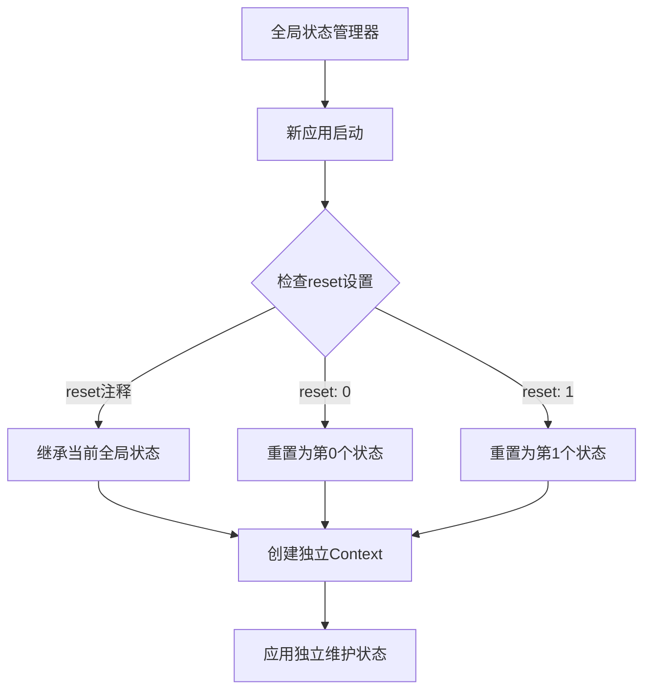

# RIME开关控制与Python服务端集成指南

## 目录
1. [RIME开关机制原理](#1-rime开关机制原理)
2. [上下文管理机制](#2-上下文管理机制)
3. [状态传播机制深度分析](#3-状态传播机制深度分析)
4. [开关配置详解](#4-开关配置详解)
5. [Python服务端控制策略](#5-python服务端控制策略)
6. [实际应用场景](#6-实际应用场景)
7. [最佳实践与建议](#7-最佳实践与建议)

---

## 1. RIME开关机制原理

### 1.1 基础概念

RIME输入法的开关（switches）是一个复杂的状态管理系统，每个开关都有以下特性：

- **名称（name）**：开关的唯一标识符
- **状态列表（states）**：显示给用户的状态名称
- **重置行为（reset）**：控制开关的初始化行为
- **选项组（options）**：用于多选项开关

### 1.2 开关的内在逻辑

开关的实际功能是硬编码在RIME程序中的，与`states`数组中的显示内容无关：

```yaml
# 示例：中英标点符号开关
- name: ascii_punct
  states: [ 。,. ]  # 这只是显示用的符号
  # reset: 0        # 默认状态（中文标点）
```

**重要原理**：
- `ascii_punct = false`（第0个状态）：使用**中文标点符号**
- `ascii_punct = true`（第1个状态）：使用**英文标点符号**

`states`数组的作用仅限于：
1. 在状态栏显示当前状态
2. 提供用户界面提示
3. **不控制**实际功能行为

---

## 2. 上下文管理机制

### 2.1 会话（Session）模型

RIME为每个应用程序创建独立的会话：

```
应用A ──── Session A ──── Context A
应用B ──── Session B ──── Context B  
应用C ──── Session C ──── Context C
```

每个Context包含：
- 开关状态
- 输入模式
- 用户词典状态
- 候选词列表

### 2.2 观察到的现象分析

基于您的观察，我们可以总结出以下规律：

#### 场景1：reset注释掉的情况
```yaml
- name: ascii_punct
  states: [ 。,. ]
  # reset: 0  # 注释掉
```

**行为表现**：
1. 应用A修改为英文标点 → 应用B首次打开继承英文标点
2. 应用A改回中文标点 → 应用B保持英文标点（独立状态）
3. 新应用C启动 → 获取最新状态（中文标点）

#### 场景2：reset设置为0或1
```yaml
- name: ascii_punct
  states: [ 。,. ]
  reset: 0  # 或 reset: 1
```

**行为表现**：
- `reset: 0`：每次切换应用时重置为第0个状态（中文标点）
- `reset: 1`：每次切换应用时重置为第1个状态（英文标点）

---

## 3. 状态传播机制深度分析

### 3.1 状态继承规则



### 3.2 状态同步机制

RIME的状态同步遵循以下原则：

1. **首次创建会话**：新应用继承当前全局开关状态
2. **会话存在期间**：各应用状态独立维护，不自动同步
3. **新应用启动**：总是获取最新的全局状态
4. **全局配置更改**：只影响新启动的应用

---

## 4. 开关配置详解

### 4.1 基础开关类型

#### 4.1.1 简单二元开关
```yaml
- name: ascii_mode
  states: [ 中, 英 ]
  # reset: 0
```

#### 4.1.2 多选项组开关
```yaml
- options: [ comment_off, fuzhu_hint, tone_hint ]
  states: [ 注关, 辅开, 调开 ]
```

#### 4.1.3 开关组（轮询模式）
```yaml
- options: [ s2s, s2t, s2hk, s2tw ]
  states: [ 简体, 通繁, 港繁, 臺繁 ]
```

### 4.2 万象拼音中的关键开关

| 开关名称 | 功能描述 | 影响组件 | 快捷键 |
|----------|----------|----------|--------|
| `ascii_mode` | 中英输入状态 | 全局输入模式 | - |
| `ascii_punct` | 中英标点符号 | 标点处理器 | - |
| `full_shape` | 全角半角字符 | 字符输出格式 | - |
| `emoji` | 表情符号显示 | OpenCC滤镜 | - |
| `chinese_english` | 中英翻译模式 | 翻译滤镜 | Ctrl+E |
| `tone_display` | 声调显示 | super_preedit.lua | Ctrl+S |
| `chaifen_switch` | 拆分提醒 | super_comment.lua | Ctrl+C |
| `charset_filter` | 字符集过滤 | chars_filter.lua | Ctrl+G |
| `super_tips` | 超级提示 | super_tips.lua | Ctrl+T |
| `prediction` | 预测输入 | predict插件 | - |

### 4.3 Reset参数详解

```yaml
# 三种reset配置方式：

# 方式1：注释掉（推荐用于个性化配置）
- name: ascii_punct
  states: [ 。,. ]
  # reset: 0

# 方式2：固定重置为第0个状态
- name: ascii_punct
  states: [ 。,. ]
  reset: 0

# 方式3：固定重置为第1个状态
- name: ascii_punct
  states: [ 。,. ]
  reset: 1
```

---

## 5. Python服务端控制策略

### 5.1 理解控制限制

基于RIME的架构特点，Python服务端控制面临以下挑战：

1. **应用隔离**：每个应用的状态独立维护
2. **实时同步困难**：已启动应用不会自动同步新配置
3. **上下文复杂性**：需要识别当前活跃的应用上下文

### 5.2 Python控制策略

#### 5.2.1 配置文件动态修改
```python
import yaml
import os
from pathlib import Path

class RimeConfigManager:
    def __init__(self, rime_dir="/Users/yangxinyi/Library/Rime"):
        self.rime_dir = Path(rime_dir)
        self.schema_file = self.rime_dir / "wanxiang_pro.schema.yaml"
    
    def update_switch_reset(self, switch_name, reset_value=None):
        """
        更新开关的reset配置
        
        Args:
            switch_name: 开关名称
            reset_value: None(注释掉), 0, 1
        """
        with open(self.schema_file, 'r', encoding='utf-8') as f:
            content = f.read()
        
        # 处理reset配置
        if reset_value is None:
            # 注释掉reset行
            pattern = f"(- name: {switch_name}.*?)\n(\s+)reset: \d+"
            replacement = r"\1\n\2# reset: 0"
        else:
            # 设置reset值
            pattern = f"(- name: {switch_name}.*?)\n(\s+)(?:#\s*)?reset: \d+"
            replacement = f"\\1\n\\2reset: {reset_value}"
        
        import re
        content = re.sub(pattern, replacement, content, flags=re.DOTALL)
        
        with open(self.schema_file, 'w', encoding='utf-8') as f:
            f.write(content)
    
    def force_redeploy(self):
        """强制重新部署RIME配置"""
        # 触发RIME重新加载配置
        # 这通常需要调用RIME的API或发送系统信号
        pass
```

#### 5.2.2 实时状态监控与全局同步
```python
import subprocess
import json
import psutil
from AppKit import NSWorkspace

class RimeStateMonitor:
    def __init__(self):
        self.rime_processes = []
        self.active_sessions = {}
        
    def get_current_switches(self):
        """获取当前开关状态"""
        # 通过RIME IPC API获取当前状态
        controller = RimeIPCController()
        return controller.get_switch_states()
    
    def get_all_rime_processes(self):
        """获取所有RIME进程和会话"""
        rime_processes = []
        for proc in psutil.process_iter(['pid', 'name', 'cmdline']):
            try:
                if 'rime' in proc.info['name'].lower() or any('rime' in cmd for cmd in proc.info['cmdline']):
                    rime_processes.append({
                        'pid': proc.info['pid'],
                        'name': proc.info['name'],
                        'cmdline': proc.info['cmdline']
                    })
            except (psutil.NoSuchProcess, psutil.AccessDenied):
                continue
        return rime_processes
    
    def get_active_applications(self):
        """获取当前活跃的应用程序"""
        workspace = NSWorkspace.sharedWorkspace()
        running_apps = workspace.runningApplications()
        
        active_apps = []
        for app in running_apps:
            if app.isActive() or app.ownsMenuBar():
                active_apps.append({
                    'bundle_id': str(app.bundleIdentifier()),
                    'name': str(app.localizedName()),
                    'pid': app.processIdentifier()
                })
        return active_apps
    
    def monitor_app_switch(self):
        """监控应用切换事件"""
        import threading
        from Cocoa import NSWorkspaceDidActivateApplicationNotification
        from Foundation import NSNotificationCenter
        
        def app_switch_handler(notification):
            app = notification.userInfo()['NSWorkspaceApplicationKey']
            bundle_id = str(app.bundleIdentifier())
            self.on_app_switch(bundle_id)
        
        nc = NSNotificationCenter.defaultCenter()
        nc.addObserver_selector_name_object_(
            self, 'app_switch_handler:', 
            NSWorkspaceDidActivateApplicationNotification, None
        )
    
    def on_app_switch(self, bundle_id):
        """应用切换时的处理逻辑"""
        print(f"应用切换到: {bundle_id}")
        # 在这里可以触发状态同步逻辑
```

#### 5.2.3 全局状态管理与多会话同步
```python
import threading
import time
from concurrent.futures import ThreadPoolExecutor

class GlobalRimeStateManager:
    def __init__(self):
        self.state_cache = {}
        self.app_contexts = {}
        self.ipc_controller = RimeIPCController()
        self.state_monitor = RimeStateMonitor()
        self.sync_lock = threading.Lock()
        
    def discover_rime_sessions(self):
        """发现所有活跃的RIME会话"""
        # 方法1：通过进程扫描
        rime_processes = self.state_monitor.get_all_rime_processes()
        
        # 方法2：通过IPC端点枚举
        ipc_endpoints = self.enumerate_ipc_endpoints()
        
        # 方法3：通过应用程序关联
        active_apps = self.state_monitor.get_active_applications()
        
        sessions = {}
        for app in active_apps:
            try:
                # 尝试连接到该应用的RIME会话
                session_id = f"{app['bundle_id']}:{app['pid']}"
                if self.test_session_connection(session_id):
                    sessions[session_id] = {
                        'app_info': app,
                        'endpoint': self.get_session_endpoint(session_id),
                        'last_active': time.time()
                    }
            except Exception as e:
                print(f"无法连接到应用 {app['name']} 的RIME会话: {e}")
        
        return sessions
    
    def enumerate_ipc_endpoints(self):
        """枚举所有可用的IPC端点"""
        endpoints = []
        
        # 扫描Unix socket文件
        import glob
        socket_patterns = [
            "/tmp/rime_*.sock",
            "/var/tmp/rime_*.sock",
            f"/Users/{os.getenv('USER')}/Library/Rime/sessions/*.sock"
        ]
        
        for pattern in socket_patterns:
            for socket_path in glob.glob(pattern):
                if self.test_socket_connection(socket_path):
                    endpoints.append({
                        'type': 'unix_socket',
                        'path': socket_path,
                        'session_id': self.extract_session_id(socket_path)
                    })
        
        # 扫描TCP端口（如果支持）
        for port in range(9000, 9100):
            if self.test_tcp_connection('localhost', port):
                endpoints.append({
                    'type': 'tcp',
                    'host': 'localhost',
                    'port': port
                })
        
        return endpoints
    
    def test_session_connection(self, session_id):
        """测试与特定会话的连接"""
        try:
            # 尝试发送ping命令
            response = self.ipc_controller.send_command(session_id, {
                "action": "ping"
            })
            return response and response.get("status") == "ok"
        except Exception:
            return False
    
    def sync_state_across_all_sessions(self, switch_name, new_state):
        """同步状态到所有会话"""
        with self.sync_lock:
            # 发现所有活跃会话
            sessions = self.discover_rime_sessions()
            
            # 并发更新所有会话
            success_count = 0
            total_count = len(sessions)
            
            with ThreadPoolExecutor(max_workers=10) as executor:
                futures = []
                
                for session_id, session_info in sessions.items():
                    future = executor.submit(
                        self._update_session_state,
                        session_id, switch_name, new_state
                    )
                    futures.append((session_id, future))
                
                # 等待所有更新完成
                for session_id, future in futures:
                    try:
                        result = future.result(timeout=5.0)
                        if result:
                            success_count += 1
                            print(f"✓ 成功更新会话 {session_id}")
                        else:
                            print(f"✗ 更新会话 {session_id} 失败")
                    except Exception as e:
                        print(f"✗ 更新会话 {session_id} 异常: {e}")
            
            print(f"全局同步完成: {success_count}/{total_count} 个会话更新成功")
            
            # 同时更新配置文件，影响新启动的应用
            self.update_global_config(switch_name, new_state)
            
            return success_count, total_count
    
    def _update_session_state(self, session_id, switch_name, new_state):
        """更新单个会话的状态"""
        try:
            response = self.ipc_controller.send_command(session_id, {
                "action": "set_switch",
                "switch": switch_name,
                "state": new_state
            })
            return response and response.get("status") == "ok"
        except Exception as e:
            print(f"更新会话 {session_id} 状态失败: {e}")
            return False
    
    def batch_sync_states(self, state_changes):
        """批量同步多个状态变化"""
        """
        state_changes: dict like {'ascii_punct': True, 'emoji': False}
        """
        sessions = self.discover_rime_sessions()
        
        with ThreadPoolExecutor(max_workers=10) as executor:
            futures = []
            
            for session_id in sessions:
                future = executor.submit(
                    self._batch_update_session,
                    session_id, state_changes
                )
                futures.append((session_id, future))
            
            results = {}
            for session_id, future in futures:
                try:
                    results[session_id] = future.result(timeout=5.0)
                except Exception as e:
                    results[session_id] = False
                    print(f"批量更新会话 {session_id} 失败: {e}")
        
        return results
    
    def _batch_update_session(self, session_id, state_changes):
        """批量更新单个会话的多个状态"""
        try:
            response = self.ipc_controller.send_command(session_id, {
                "action": "batch_set_switches",
                "changes": state_changes
            })
            return response and response.get("status") == "ok"
        except Exception:
            # 如果不支持批量更新，则逐个更新
            success = True
            for switch_name, state in state_changes.items():
                try:
                    response = self.ipc_controller.send_command(session_id, {
                        "action": "set_switch",
                        "switch": switch_name,
                        "state": state
                    })
                    if not (response and response.get("status") == "ok"):
                        success = False
                except Exception:
                    success = False
            return success
    
    def update_global_config(self, switch_name, new_state):
        """更新全局配置文件"""
        config_manager = RimeConfigManager()
        reset_value = 1 if new_state else 0
        config_manager.update_switch_reset(switch_name, reset_value)
        config_manager.force_redeploy()
    
    def start_continuous_sync(self, interval=1.0):
        """启动持续同步监控"""
        def sync_worker():
            while True:
                try:
                    # 检查是否有状态变化需要同步
                    pending_changes = self.get_pending_changes()
                    if pending_changes:
                        for switch_name, new_state in pending_changes.items():
                            self.sync_state_across_all_sessions(switch_name, new_state)
                        self.clear_pending_changes()
                    
                    time.sleep(interval)
                except Exception as e:
                    print(f"持续同步异常: {e}")
                    time.sleep(interval)
        
        sync_thread = threading.Thread(target=sync_worker, daemon=True)
        sync_thread.start()
        return sync_thread
    
    def get_pending_changes(self):
        """获取待同步的变化"""
        # 这里可以实现变化检测逻辑
        # 比如监控主会话的状态变化
        return {}
    
    def clear_pending_changes(self):
        """清除待同步的变化"""
        pass
```

### 5.3 实际控制方案

#### 5.3.1 基于配置文件的控制
```python
def set_punctuation_mode(mode="chinese"):
    """
    设置标点符号模式
    
    Args:
        mode: "chinese" 或 "english"
    """
    reset_value = 0 if mode == "chinese" else 1
    
    manager = RimeConfigManager()
    manager.update_switch_reset("ascii_punct", reset_value)
    
    # 重新部署配置
    subprocess.run(["rime_deployer", "--build"], check=True)
    
    print(f"标点符号模式已设置为: {mode}")
```

#### 5.3.2 基于IPC的实时全局控制
```python
import socket
import json
import os
import glob

class RimeIPCController:
    def __init__(self):
        self.socket_path = "/tmp/rime_control.sock"
        self.session_sockets = {}
        self.discover_sessions()
    
    def discover_sessions(self):
        """发现所有RIME会话的IPC端点"""
        self.session_sockets.clear()
        
        # 方法1：扫描预定义的socket路径
        socket_patterns = [
            "/tmp/rime_*.sock",
            "/tmp/rime/session_*.sock",
            f"{os.getenv('HOME')}/Library/Rime/sessions/*.sock"
        ]
        
        for pattern in socket_patterns:
            for socket_path in glob.glob(pattern):
                session_id = self.extract_session_id_from_path(socket_path)
                if self.test_socket_connection(socket_path):
                    self.session_sockets[session_id] = socket_path
        
        # 方法2：通过主控socket获取会话列表
        try:
            session_list = self.send_command_to_socket(self.socket_path, {
                "action": "list_sessions"
            })
            if session_list and "sessions" in session_list:
                for session_info in session_list["sessions"]:
                    session_id = session_info["id"]
                    socket_path = session_info.get("socket_path")
                    if socket_path and self.test_socket_connection(socket_path):
                        self.session_sockets[session_id] = socket_path
        except Exception as e:
            print(f"无法通过主控socket获取会话列表: {e}")
    
    def extract_session_id_from_path(self, socket_path):
        """从socket路径提取会话ID"""
        import re
        # 从路径中提取会话标识
        match = re.search(r'rime_(\w+)\.sock|session_(\w+)\.sock', socket_path)
        if match:
            return match.group(1) or match.group(2)
        return os.path.basename(socket_path)
    
    def test_socket_connection(self, socket_path):
        """测试socket连接是否可用"""
        try:
            with socket.socket(socket.AF_UNIX, socket.SOCK_STREAM) as s:
                s.settimeout(1.0)
                s.connect(socket_path)
                # 发送ping测试
                s.send(json.dumps({"action": "ping"}).encode())
                response = s.recv(1024)
                result = json.loads(response.decode())
                return result.get("status") == "ok"
        except Exception:
            return False
    
    def send_command_to_socket(self, socket_path, command):
        """向指定socket发送命令"""
        try:
            with socket.socket(socket.AF_UNIX, socket.SOCK_STREAM) as s:
                s.settimeout(5.0)
                s.connect(socket_path)
                s.send(json.dumps(command).encode())
                response = s.recv(4096)
                return json.loads(response.decode())
        except Exception as e:
            print(f"向socket {socket_path} 发送命令失败: {e}")
            return None
    
    def send_command(self, session_id, command):
        """向指定会话发送命令"""
        if session_id in self.session_sockets:
            socket_path = self.session_sockets[session_id]
            return self.send_command_to_socket(socket_path, command)
        else:
            print(f"未找到会话 {session_id} 的socket连接")
            return None
    
    def send_switch_command(self, switch_name, state, session_id=None):
        """发送开关命令"""
        command = {
            "action": "set_switch",
            "switch": switch_name,
            "state": state
        }
        
        if session_id:
            # 发送到指定会话
            return self.send_command(session_id, command)
        else:
            # 发送到当前活跃会话
            return self.send_command_to_socket(self.socket_path, command)
    
    def broadcast_switch_command(self, switch_name, state):
        """广播开关命令到所有会话"""
        results = {}
        self.discover_sessions()  # 刷新会话列表
        
        for session_id, socket_path in self.session_sockets.items():
            command = {
                "action": "set_switch",
                "switch": switch_name,
                "state": state
            }
            result = self.send_command_to_socket(socket_path, command)
            results[session_id] = result
            
            if result and result.get("status") == "ok":
                print(f"✓ 会话 {session_id} 开关更新成功")
            else:
                print(f"✗ 会话 {session_id} 开关更新失败")
        
        return results
    
    def get_all_switch_states(self):
        """获取所有会话的开关状态"""
        states = {}
        
        for session_id, socket_path in self.session_sockets.items():
            command = {"action": "get_switches"}
            result = self.send_command_to_socket(socket_path, command)
            
            if result and "switches" in result:
                states[session_id] = result["switches"]
        
        return states
    
    def sync_switch_globally(self, switch_name, target_state):
        """全局同步开关状态"""
        print(f"开始全局同步开关 {switch_name} 到状态 {target_state}")
        
        # 1. 广播到所有现有会话
        broadcast_results = self.broadcast_switch_command(switch_name, target_state)
        
        # 2. 更新配置文件（影响新启动的应用）
        config_manager = RimeConfigManager()
        reset_value = 1 if target_state else 0
        config_manager.update_switch_reset(switch_name, reset_value)
        
        # 3. 统计结果
        success_count = sum(1 for result in broadcast_results.values() 
                           if result and result.get("status") == "ok")
        total_count = len(broadcast_results)
        
        print(f"全局同步完成: {success_count}/{total_count} 个会话同步成功")
        
        return {
            "success_count": success_count,
            "total_count": total_count,
            "results": broadcast_results
        }
    
    def batch_sync_switches(self, switch_changes):
        """批量同步多个开关"""
        """
        switch_changes: dict like {'ascii_punct': True, 'emoji': False}
        """
        print(f"开始批量同步 {len(switch_changes)} 个开关")
        
        results = {}
        for switch_name, state in switch_changes.items():
            results[switch_name] = self.sync_switch_globally(switch_name, state)
        
        return results
    
    def monitor_and_sync(self, master_session_id, target_switches=None):
        """监控主会话并同步到其他会话"""
        """
        master_session_id: 主会话ID，其他会话将跟随其状态
        target_switches: 要同步的开关列表，None表示同步所有
        """
        if target_switches is None:
            target_switches = [
                "ascii_punct", "full_shape", "emoji", 
                "chinese_english", "tone_display"
            ]
        
        last_states = {}
        
        while True:
            try:
                # 获取主会话当前状态
                command = {"action": "get_switches"}
                result = self.send_command(master_session_id, command)
                
                if result and "switches" in result:
                    current_states = result["switches"]
                    
                    # 检查状态变化
                    for switch_name in target_switches:
                        if switch_name in current_states:
                            current_state = current_states[switch_name]
                            
                            if (switch_name not in last_states or 
                                last_states[switch_name] != current_state):
                                
                                print(f"检测到主会话 {switch_name} 状态变化: {current_state}")
                                
                                # 同步到其他会话
                                self.broadcast_switch_command(switch_name, current_state)
                                last_states[switch_name] = current_state
                
                time.sleep(0.5)  # 检查间隔
                
            except KeyboardInterrupt:
                print("停止监控同步")
                break
            except Exception as e:
                print(f"监控同步异常: {e}")
                time.sleep(1.0)
```

---

## 6. 实际应用场景

### 6.1 场景1：智能标点符号切换

根据当前应用自动调整标点符号模式：

```python
class SmartPunctuationManager:
    def __init__(self):
        self.programming_apps = {
            "com.microsoft.VSCode",
            "com.jetbrains.pycharm",
            "com.apple.Terminal"
        }
    
    def auto_switch_punctuation(self, current_app):
        """根据当前应用自动切换标点符号"""
        if current_app in self.programming_apps:
            # 编程应用使用英文标点
            self.set_punctuation("english")
        else:
            # 其他应用使用中文标点
            self.set_punctuation("chinese")
    
    def set_punctuation(self, mode):
        controller = RimeIPCController()
        state = True if mode == "english" else False
        controller.send_switch_command("ascii_punct", state)
```

### 6.2 场景2：上下文感知的输入模式

```python
class ContextAwareInputManager:
    def __init__(self):
        self.context_rules = {
            "email": {"ascii_punct": True, "emoji": False},
            "coding": {"ascii_mode": True, "ascii_punct": True},
            "writing": {"ascii_punct": False, "emoji": True},
            "chatting": {"emoji": True, "chinese_english": True}
        }
    
    def apply_context(self, context_type):
        """应用特定上下文的输入配置"""
        if context_type in self.context_rules:
            rules = self.context_rules[context_type]
            controller = RimeIPCController()
            
            for switch, state in rules.items():
                controller.send_switch_command(switch, state)
```

### 6.3 场景3：全局状态同步

```python
class GlobalStateSyncer:
    def __init__(self):
        self.target_switches = [
            "ascii_punct",
            "full_shape", 
            "emoji"
        ]
        self.ipc_controller = RimeIPCController()
        self.global_manager = GlobalRimeStateManager()
    
    def sync_all_apps(self):
        """同步所有应用的关键开关状态"""
        # 获取主应用的当前状态
        main_state = self.get_main_app_state()
        
        # 更新配置文件
        for switch, state in main_state.items():
            if switch in self.target_switches:
                self.update_global_switch(switch, state)
        
        # 重新部署并通知所有应用
        self.force_global_update()
    
    def get_main_app_state(self):
        """获取主应用状态"""
        return self.ipc_controller.send_command_to_socket(
            self.ipc_controller.socket_path, 
            {"action": "get_switches"}
        ).get("switches", {})
    
    def update_global_switch(self, switch_name, state):
        """更新全局开关状态"""
        return self.global_manager.sync_state_across_all_sessions(switch_name, state)
    
    def force_global_update(self):
        """强制全局更新"""
        config_manager = RimeConfigManager()
        config_manager.force_redeploy()

# 使用示例
def example_global_sync():
    """全局同步使用示例"""
    
    # 1. 创建控制器
    ipc_controller = RimeIPCController()
    global_manager = GlobalRimeStateManager()
    
    # 2. 单个开关全局同步
    print("=== 单个开关全局同步 ===")
    result = ipc_controller.sync_switch_globally("ascii_punct", True)
    print(f"同步结果: {result}")
    
    # 3. 批量开关同步
    print("\n=== 批量开关同步 ===")
    batch_changes = {
        "ascii_punct": False,  # 中文标点
        "emoji": True,         # 开启表情
        "full_shape": False    # 半角字符
    }
    batch_results = ipc_controller.batch_sync_switches(batch_changes)
    
    for switch, result in batch_results.items():
        print(f"{switch}: {result['success_count']}/{result['total_count']} 成功")
    
    # 4. 启动主从同步监控
    print("\n=== 启动主从同步监控 ===")
    # 假设当前应用的会话ID为 "current"
    # 这将监控当前应用的状态变化，并自动同步到其他应用
    try:
        ipc_controller.monitor_and_sync("current", ["ascii_punct", "emoji"])
    except KeyboardInterrupt:
        print("监控已停止")
    
    # 5. 获取所有会话状态
    print("\n=== 获取所有会话状态 ===")
    all_states = ipc_controller.get_all_switch_states()
    for session_id, switches in all_states.items():
        print(f"会话 {session_id}:")
        for switch, state in switches.items():
            print(f"  {switch}: {state}")
```

---

## 7. 最佳实践与建议

### 7.1 配置策略建议

1. **对于个人习惯性开关**：使用`# reset: 0`（注释掉），保持用户选择
2. **对于应用特定开关**：使用`reset: 0/1`，确保一致性
3. **对于临时功能开关**：通过Python动态控制

### 7.2 Python集成建议

#### 7.2.1 混合控制策略
```python
class HybridRimeController:
    def __init__(self):
        self.config_manager = RimeConfigManager()
        self.ipc_controller = RimeIPCController()
        self.state_monitor = RimeStateMonitor()
    
    def smart_control(self, switch_name, target_state, scope="current"):
        """
        智能控制策略
        
        Args:
            switch_name: 开关名称
            target_state: 目标状态
            scope: "current" (当前应用) 或 "global" (全局)
        """
        if scope == "current":
            # 实时控制当前应用
            return self.ipc_controller.send_switch_command(
                switch_name, target_state
            )
        elif scope == "global":
            # 全局配置更新
            reset_value = 1 if target_state else 0
            self.config_manager.update_switch_reset(
                switch_name, reset_value
            )
            return self.config_manager.force_redeploy()
```

#### 7.2.2 状态持久化
```python
import json
from datetime import datetime

class RimeStateHistory:
    def __init__(self, history_file="rime_state_history.json"):
        self.history_file = history_file
        self.load_history()
    
    def record_state_change(self, app_id, switch_name, old_state, new_state):
        """记录状态变化历史"""
        record = {
            "timestamp": datetime.now().isoformat(),
            "app_id": app_id,
            "switch": switch_name,
            "old_state": old_state,
            "new_state": new_state
        }
        self.history.append(record)
        self.save_history()
    
    def get_preferred_state(self, app_id, switch_name):
        """根据历史记录推断首选状态"""
        app_records = [
            r for r in self.history 
            if r["app_id"] == app_id and r["switch"] == switch_name
        ]
        
        if app_records:
            return app_records[-1]["new_state"]
        return None
```

### 7.3 调试和监控建议

```python
class RimeDebugger:
    def __init__(self):
        self.log_file = "rime_debug.log"
    
    def log_switch_change(self, context):
        """记录开关变化日志"""
        timestamp = datetime.now().isoformat()
        log_entry = f"[{timestamp}] {context}\n"
        
        with open(self.log_file, 'a', encoding='utf-8') as f:
            f.write(log_entry)
    
    def analyze_state_patterns(self):
        """分析状态变化模式"""
        # 分析日志文件，找出状态变化规律
        pass
```

---

## 9. 全局同步实现指南

基于您已经实现了IPC功能的情况，以下是实现全局同步的具体方案：

### 9.1 核心思路

RIME的每个应用都有独立的Context，要实现全局同步需要：

1. **发现机制**：找到所有活跃的RIME会话
2. **通信机制**：通过IPC与每个会话通信
3. **同步策略**：决定何时、如何同步状态
4. **配置更新**：同时更新配置文件影响新应用

### 9.2 IPC会话发现策略

#### 9.2.1 基于Socket文件扫描
```python
def discover_sessions_by_socket_scan():
    """通过扫描socket文件发现会话"""
    import glob
    import os
    
    socket_patterns = [
        "/tmp/rime_*.sock",
        "/tmp/rime/session_*.sock", 
        f"{os.getenv('HOME')}/Library/Rime/sessions/*.sock",
        "/var/run/rime/*.sock"
    ]
    
    sessions = {}
    for pattern in socket_patterns:
        for socket_path in glob.glob(pattern):
            session_id = extract_session_id(socket_path)
            if test_socket_connection(socket_path):
                sessions[session_id] = {
                    'socket_path': socket_path,
                    'type': 'unix_socket'
                }
    
    return sessions
```

#### 9.2.2 基于进程扫描
```python
def discover_sessions_by_process_scan():
    """通过进程扫描发现RIME会话"""
    import psutil
    
    sessions = {}
    for proc in psutil.process_iter(['pid', 'name', 'cmdline', 'connections']):
        try:
            # 检查是否是RIME相关进程
            if is_rime_process(proc):
                session_id = f"pid_{proc.info['pid']}"
                sessions[session_id] = {
                    'pid': proc.info['pid'],
                    'name': proc.info['name'],
                    'type': 'process'
                }
        except (psutil.NoSuchProcess, psutil.AccessDenied):
            continue
    
    return sessions
```

#### 9.2.3 基于应用程序关联
```python
def discover_sessions_by_app_association():
    """通过应用程序关联发现会话"""
    from AppKit import NSWorkspace
    
    workspace = NSWorkspace.sharedWorkspace()
    running_apps = workspace.runningApplications()
    
    sessions = {}
    for app in running_apps:
        bundle_id = str(app.bundleIdentifier())
        
        # 检查该应用是否有RIME会话
        session_socket = find_app_rime_socket(bundle_id, app.processIdentifier())
        if session_socket:
            session_id = f"app_{bundle_id}"
            sessions[session_id] = {
                'app_bundle_id': bundle_id,
                'app_pid': app.processIdentifier(),
                'socket_path': session_socket,
                'type': 'app_associated'
            }
    
    return sessions
```

### 9.3 全局同步实现模式

#### 9.3.1 立即同步模式
```python
class ImmediateSyncManager:
    """立即同步模式：状态变化时立即同步到所有会话"""
    
    def __init__(self):
        self.ipc_controller = RimeIPCController()
        self.sessions = {}
        self.refresh_sessions()
    
    def refresh_sessions(self):
        """刷新会话列表"""
        self.sessions = self.discover_all_sessions()
    
    def sync_immediately(self, switch_name, new_state):
        """立即同步到所有会话"""
        print(f"立即同步 {switch_name} = {new_state}")
        
        success_count = 0
        total_count = len(self.sessions)
        
        for session_id, session_info in self.sessions.items():
            try:
                result = self.update_session_switch(session_id, switch_name, new_state)
                if result:
                    success_count += 1
                    print(f"✓ {session_id}")
                else:
                    print(f"✗ {session_id}")
            except Exception as e:
                print(f"✗ {session_id}: {e}")
        
        # 同时更新配置文件
        self.update_config_file(switch_name, new_state)
        
        return success_count, total_count
```

#### 9.3.2 主从同步模式
```python
class MasterSlaveSyncManager:
    """主从同步模式：监控主会话，其他会话跟随"""
    
    def __init__(self, master_session_id):
        self.master_session_id = master_session_id
        self.ipc_controller = RimeIPCController()
        self.last_states = {}
        self.slave_sessions = {}
        self.is_monitoring = False
    
    def start_monitoring(self, target_switches=None):
        """开始监控主会话"""
        if target_switches is None:
            target_switches = ["ascii_punct", "full_shape", "emoji"]
        
        self.is_monitoring = True
        
        while self.is_monitoring:
            try:
                # 获取主会话状态
                current_states = self.get_master_states()
                
                # 检查变化并同步
                for switch_name in target_switches:
                    if switch_name in current_states:
                        current_state = current_states[switch_name]
                        
                        if (switch_name not in self.last_states or 
                            self.last_states[switch_name] != current_state):
                            
                            print(f"主会话 {switch_name} 变化: {current_state}")
                            self.sync_to_slaves(switch_name, current_state)
                            self.last_states[switch_name] = current_state
                
                time.sleep(0.5)
                
            except Exception as e:
                print(f"监控异常: {e}")
                time.sleep(1.0)
    
    def sync_to_slaves(self, switch_name, state):
        """同步到从会话"""
        self.refresh_slave_sessions()
        
        for session_id in self.slave_sessions:
            if session_id != self.master_session_id:
                try:
                    self.update_session_switch(session_id, switch_name, state)
                except Exception as e:
                    print(f"同步到 {session_id} 失败: {e}")
```

#### 9.3.3 事件驱动同步模式
```python
class EventDrivenSyncManager:
    """事件驱动同步模式：基于系统事件触发同步"""
    
    def __init__(self):
        self.ipc_controller = RimeIPCController()
        self.pending_syncs = {}
        self.sync_queue = Queue()
        self.worker_thread = None
        
    def start_event_monitoring(self):
        """开始事件监控"""
        # 监控应用切换事件
        self.monitor_app_switch_events()
        
        # 监控RIME状态变化事件
        self.monitor_rime_state_events()
        
        # 启动同步工作线程
        self.start_sync_worker()
    
    def on_app_switch(self, from_app, to_app):
        """应用切换事件处理"""
        # 获取源应用的状态
        source_states = self.get_app_states(from_app)
        
        # 加入同步队列
        self.sync_queue.put({
            'type': 'app_switch',
            'source_app': from_app,
            'target_app': to_app,
            'states': source_states
        })
    
    def on_rime_state_change(self, session_id, switch_name, new_state):
        """RIME状态变化事件处理"""
        self.sync_queue.put({
            'type': 'state_change',
            'session_id': session_id,
            'switch_name': switch_name,
            'new_state': new_state
        })
    
    def start_sync_worker(self):
        """启动同步工作线程"""
        def sync_worker():
            while True:
                try:
                    event = self.sync_queue.get(timeout=1.0)
                    self.process_sync_event(event)
                except Empty:
                    continue
                except Exception as e:
                    print(f"同步工作线程异常: {e}")
        
        self.worker_thread = threading.Thread(target=sync_worker, daemon=True)
        self.worker_thread.start()
```

### 9.4 配置文件同步策略

```python
class ConfigFileSyncManager:
    """配置文件同步管理器"""
    
    def __init__(self, rime_dir="/Users/yangxinyi/Library/Rime"):
        self.rime_dir = Path(rime_dir)
        self.schema_files = [
            "wanxiang_pro.schema.yaml",
            "user.yaml"
        ]
    
    def sync_switch_to_config(self, switch_name, target_state):
        """将开关状态同步到配置文件"""
        reset_value = 1 if target_state else 0
        
        for schema_file in self.schema_files:
            file_path = self.rime_dir / schema_file
            if file_path.exists():
                self.update_switch_in_file(file_path, switch_name, reset_value)
    
    def update_switch_in_file(self, file_path, switch_name, reset_value):
        """更新单个文件中的开关配置"""
        with open(file_path, 'r', encoding='utf-8') as f:
            content = f.read()
        
        # 查找开关配置
        import re
        pattern = f"(- name: {switch_name}.*?)(\n\\s+)(#\\s*)?reset: \\d+"
        
        if reset_value is None:
            # 注释掉reset
            replacement = r"\1\2# reset: 0"
        else:
            # 设置reset值
            replacement = f"\\1\\2reset: {reset_value}"
        
        new_content = re.sub(pattern, replacement, content, flags=re.DOTALL)
        
        if new_content != content:
            with open(file_path, 'w', encoding='utf-8') as f:
                f.write(new_content)
            print(f"已更新 {file_path} 中的 {switch_name}")
    
    def trigger_redeploy(self):
        """触发RIME重新部署"""
        try:
            # 方法1：通过命令行
            subprocess.run(["rime_deployer", "--build"], check=True)
        except:
            try:
                # 方法2：通过IPC通知
                ipc_controller = RimeIPCController()
                ipc_controller.send_command_to_socket("/tmp/rime_control.sock", {
                    "action": "redeploy"
                })
            except:
                print("无法触发重新部署，请手动部署RIME")
```

### 9.5 完整使用示例

```python
def main():
    """完整的全局同步使用示例"""
    
    # 1. 选择同步模式
    sync_mode = input("选择同步模式 (1:立即同步 2:主从同步 3:事件驱动): ")
    
    if sync_mode == "1":
        # 立即同步模式
        manager = ImmediateSyncManager()
        
        # 执行同步
        success, total = manager.sync_immediately("ascii_punct", False)
        print(f"立即同步完成: {success}/{total}")
        
    elif sync_mode == "2":
        # 主从同步模式
        master_session = input("输入主会话ID (默认: current): ") or "current"
        manager = MasterSlaveSyncManager(master_session)
        
        print(f"开始监控主会话 {master_session}...")
        try:
            manager.start_monitoring()
        except KeyboardInterrupt:
            print("停止监控")
            
    elif sync_mode == "3":
        # 事件驱动模式
        manager = EventDrivenSyncManager()
        manager.start_event_monitoring()
        
        print("事件驱动同步已启动...")
        try:
            while True:
                time.sleep(1)
        except KeyboardInterrupt:
            print("停止事件监控")

if __name__ == "__main__":
    main()
```

### 9.6 调试和故障排除

```python
class SyncDebugger:
    """同步调试工具"""
    
    def __init__(self):
        self.ipc_controller = RimeIPCController()
    
    def diagnose_sync_issues(self):
        """诊断同步问题"""
        print("=== RIME同步诊断 ===")
        
        # 1. 检查IPC连接
        print("1. 检查IPC连接...")
        self.check_ipc_connections()
        
        # 2. 检查会话状态
        print("2. 检查会话状态...")
        self.check_session_states()
        
        # 3. 检查配置文件
        print("3. 检查配置文件...")
        self.check_config_files()
        
        # 4. 测试同步功能
        print("4. 测试同步功能...")
        self.test_sync_functionality()
    
    def check_ipc_connections(self):
        """检查IPC连接状态"""
        sessions = self.ipc_controller.discover_sessions()
        print(f"发现 {len(sessions)} 个会话:")
        
        for session_id, socket_path in sessions.items():
            status = "✓" if self.ipc_controller.test_socket_connection(socket_path) else "✗"
            print(f"  {status} {session_id}: {socket_path}")
    
    def check_session_states(self):
        """检查所有会话的状态"""
        all_states = self.ipc_controller.get_all_switch_states()
        
        for session_id, switches in all_states.items():
            print(f"会话 {session_id}:")
            for switch, state in switches.items():
                print(f"  {switch}: {state}")
    
    def test_sync_functionality(self):
        """测试同步功能"""
        print("测试同步 ascii_punct 开关...")
        
        # 获取当前状态
        current_states = self.ipc_controller.get_all_switch_states()
        
        # 执行同步
        result = self.ipc_controller.sync_switch_globally("ascii_punct", True)
        print(f"同步结果: {result}")
        
        # 验证同步结果
        time.sleep(1)
        new_states = self.ipc_controller.get_all_switch_states()
        
        # 对比状态
        for session_id in current_states:
            if session_id in new_states:
                old_state = current_states[session_id].get("ascii_punct")
                new_state = new_states[session_id].get("ascii_punct") 
                print(f"  {session_id}: {old_state} -> {new_state}")
```

通过以上的全局同步实现方案，您可以：

1. **发现所有RIME会话**：通过多种方式发现活跃的会话
2. **实时同步状态**：通过IPC立即同步开关状态
3. **选择同步模式**：根据需要选择立即同步、主从同步或事件驱动
4. **配置文件同步**：同时更新配置文件影响新启动的应用
5. **调试和监控**：提供完整的调试和故障排除工具

这样就能实现真正的全局状态同步，解决您提到的只能修改当前应用配置的问题。

---

## 8. 总结

RIME输入法的开关控制是一个复杂的多层次系统，涉及：

1. **配置层面**：通过schema文件定义开关行为
2. **会话层面**：每个应用维护独立的状态上下文
3. **全局层面**：新应用继承全局状态配置

Python服务端要有效控制RIME开关，需要：

1. **理解RIME的状态传播机制**
2. **采用混合控制策略**（配置文件+实时IPC）
3. **实现智能上下文感知**
4. **建立状态监控和历史记录系统**

通过合理的架构设计和实现策略，可以实现对RIME输入法的精细化控制，提升用户体验。

---

## 附录

### A. 常用开关状态速查表

| 开关名称 | False状态 | True状态 | 推荐reset设置 |
|----------|-----------|----------|---------------|
| ascii_mode | 中文输入 | 英文输入 | 注释掉 |
| ascii_punct | 中文标点 | 英文标点 | 注释掉 |
| full_shape | 半角字符 | 全角字符 | reset: 0 |
| emoji | 不显示表情 | 显示表情 | reset: 0 |
| prediction | 关闭预测 | 开启预测 | 注释掉 |

### B. 相关文件路径

- 主配置文件：`/Users/yangxinyi/Library/Rime/wanxiang_pro.schema.yaml`
- 用户配置：`/Users/yangxinyi/Library/Rime/user.yaml`
- 构建目录：`/Users/yangxinyi/Library/Rime/build/`
- 日志目录：`/Users/yangxinyi/Library/Rime/log/`
