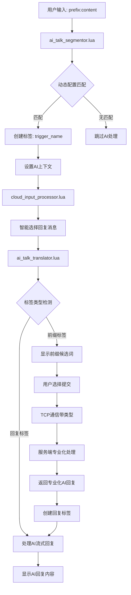
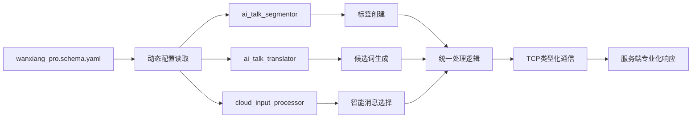

# 万象输入法AI助手系统完整升级文档

## 🎯 项目概述

我们已经完成了对 Rime 万象输入法 AI 助手系统的全面优化升级，从硬编码的单一触发器系统升级为完全配置驱动的多触发器专业化AI平台。

## 🚀 升级亮点

### 核心改进
- ✅ **从单一到多元**：从只支持 `a:` 触发器扩展到11种专业AI助手
- ✅ **从硬编码到配置驱动**：所有触发器通过配置文件动态读取，支持无限扩展
- ✅ **从通用到专业化**：每种AI助手都有专门的功能定位和服务端支持
- ✅ **从静态到智能**：系统能够智能识别用户意图并提供相应的专业化服务

### 技术特色
- **动态配置读取**：使用正确的 Rime Lua API (`config:get_map()` + `keys()`)
- **统一标签处理**：所有模块使用相同的标签逻辑和处理模式
- **类型化通信**：TCP消息包含 `chat_type` 参数，支持服务端专业化处理
- **向后兼容**：现有功能完全保持不变，用户习惯不受影响

## 📋 支持的AI助手功能

| 触发器前缀 | 功能名称 | 标签标识 | 回复消息 | 专业用途 |
|-----------|----------|----------|----------|----------|
| `a:` | 简单对话 | `simple_ai_chat` | `"简单对话:"` | 日常对话交流 |
| `ai:` | AI对话 | `ai_chat` | `"AI对话:"` | 增强AI对话 |
| `ac:` | 上下文对话 | `context_chat` | `"上下文对话:"` | 多轮上下文感知对话 |
| `ar:` | 角色扮演 | `role_chat` | `"角色扮演:"` | 专业角色扮演对话 |
| `t:` | 翻译助手 | `translate_assistant` | `"翻译助手:"` | 中英互译、多语言翻译 |
| `code:` | 编程助手 | `code_assistant` | `"编程助手:"` | 代码生成、调试、优化 |
| `write:` | 写作助手 | `write_assistant` | `"写作助手:"` | 文档写作、内容创作 |
| `s:` | 搜索助手 | `search_assistant` | `"搜索助手:"` | 信息检索、知识搜索 |
| `sum:` | 总结工具 | `summarize` | `"总结工具:"` | 内容摘要、要点提取 |
| `exp:` | 解释工具 | `explain` | `"解释工具:"` | 概念解释、原理说明 |
| `imp:` | 改进工具 | `improve` | `"改进工具:"` | 内容优化、建议改进 |

## 🔧 核心配置文件 (wanxiang_pro.schema.yaml)

### 完整AI助手配置
```yaml
ai_assistant:
  enabled: true
  behavior:
    commit_input: true         # 是否将用户提问上屏
    auto_commit: false        # 是否自动上屏
    clipboard_mode: true      # 是否使用剪贴板模式
  
  # 触发器配置：定义所有AI助手的前缀
  chat_triggers:
    simple_ai_chat: "a:"          # 简单对话
    ai_chat: "ai:"                # AI对话
    context_chat: "ac:"           # 上下文对话
    role_chat: "ar:"              # 角色扮演对话
    translate_assistant: "t:"     # 中英翻译
    code_assistant: "code:"       # 编程助手
    write_assistant: "write:"     # 写作助手
    search_assistant: "s:"        # 搜索助手
    summarize: "sum:"             # 总结工具
    explain: "exp:"               # 解释工具
    improve: "imp:"               # 改进工具
  
  # 回复消息配置：定义每个触发器对应的显示消息
  reply_messages:
    simple_ai_chat: "简单对话:"
    ai_chat: "AI对话:"
    context_chat: "上下文对话:"
    role_chat: "角色扮演:"
    translate_assistant: "翻译助手:"
    code_assistant: "编程助手:"
    write_assistant: "写作助手:"
    search_assistant: "搜索助手:"
    summarize: "总结工具:"
    explain: "解释工具:"
    improve: "改进工具:"
  
  # 标签配置：定义回复时使用的标签标识
  reply_tags:
    simple_ai_chat: "simple_ai_chat"
    ai_chat: "ai_chat"
    context_chat: "context_chat"
    role_chat: "role_chat"
    translate_assistant: "translate_assistant"
    code_assistant: "code_assistant"
    write_assistant: "write_assistant"
    search_assistant: "search_assistant"
    summarize: "summarize"
    explain: "explain"
    improve: "improve"
```

## 🛠️ 代码实现详解

### 1. 分词器优化 (ai_talk_segmentor.lua)

**核心改进：**
- ✅ 移除硬编码触发器数组，使用动态配置读取
- ✅ 使用正确的 Rime Lua API：`config:get_map()` 和 `keys()`
- ✅ 统一标签处理：使用触发器名称作为标签
- ✅ 支持无限数量的触发器类型

**关键代码逻辑：**
```lua
-- 动态读取配置，替代硬编码数组
local chat_triggers_config = config:get_map("ai_assistant/chat_triggers")
if chat_triggers_config then
    local trigger_keys = chat_triggers_config:keys()
    logger.info("找到 " .. #trigger_keys .. " 个触发器配置")
    
    for _, trigger_name in ipairs(trigger_keys) do
        local trigger_value = config:get_string("ai_assistant/chat_triggers/" .. trigger_name)
        env.ai_assistant_config.chat_triggers[trigger_name] = trigger_value
        
        -- 检测触发器匹配
        if input:match("^" .. escaped_prefix .. ".") then
            ai_segment.tags = Set {trigger_name}  -- 使用触发器名称作为标签
            context:set_property("current_ai_context", trigger_name)
        end
    end
end
```

### 2. 翻译器重构 (ai_talk_translator.lua)

**主要改进：**
- ✅ 移除 `ai_talk` 特殊处理逻辑，实现完全统一的处理
- ✅ 支持所有配置的触发器标签检测
- ✅ 配置驱动的回复消息显示
- ✅ 多触发器类型的TCP通信支持

**核心处理逻辑：**
```lua
-- 前缀显示：检查触发器标签
for trigger_name, trigger_prefix in pairs(env.ai_assistant_config.chat_triggers) do
    if segment:has_tag(trigger_name) then
        local reply_message = env.ai_assistant_config.reply_messages[trigger_name]
        -- 生成前缀候选词
        yield(Candidate("ai_prefix", seg.start, seg._end, "", reply_message))
    end
end

-- AI回复显示：检查回复标签
for tag, trigger in pairs(env.ai_assistant_config.tag_to_trigger) do
    if segment:has_tag(tag) then
        -- 处理AI流式回复
        -- 显示相应的回复内容
    end
end

-- TCP通信：发送类型化消息
tcp_socket.send_chat_message(commit_text, matched_trigger)
```

### 3. 处理器同步 (cloud_input_processor.lua)

**智能回复消息选择：**
```lua
-- 动态选择合适的回复消息
local function get_current_ai_reply_message(env, context)
    -- 优先使用设置的AI上下文
    local current_ai_context = context:get_property("current_ai_context")
    if current_ai_context and env.ai_assistant_config.reply_messages[current_ai_context] then
        return env.ai_assistant_config.reply_messages[current_ai_context]
    end
    
    -- 从输入历史推断并回退到默认
    return env.ai_assistant_config.reply_messages.simple_ai_chat or "简单对话:"
end
```

### 4. TCP通信增强 (tcp_socket_sync.lua)

**新的消息格式：**
```lua
function tcp_socket.send_chat_message(message, chat_type)
    chat_type = chat_type or "simple_ai_chat"  -- 默认类型
    
    local json_data = {
        messege_type = "chat",
        commit_text = message,
        chat_type = chat_type,           -- 新增类型字段
        timestamp = os.time()
    }
    
    -- 发送类型化消息给服务端
end
```

## 🔄 系统工作流程

### 完整处理流程图


### 配置驱动架构


## 🧪 使用示例与测试

### 基本功能测试
```bash
# 编程助手测试
输入: code:写一个排序函数
预期: 显示"编程助手："前缀
TCP: {"chat_type": "code_assistant", "commit_text": "写一个排序函数"}

# 翻译助手测试  
输入: t:Hello world
预期: 显示"翻译助手："前缀
TCP: {"chat_type": "translate_assistant", "commit_text": "Hello world"}

# 角色扮演测试
输入: ar:你好，我是历史学家
预期: 显示"角色扮演："前缀
TCP: {"chat_type": "role_chat", "commit_text": "你好，我是历史学家"}
```

### 扩展性测试
在配置文件中添加新触发器：
```yaml
chat_triggers:
  math_assistant: "math:"
reply_messages:
  math_assistant: "数学助手："
reply_tags:
  math_assistant: "math_assistant"
```
系统会自动识别并支持新的 `math:` 触发器。

## 🎨 扩展性优势

### 1. 无限扩展能力
- **添加新功能**：只需修改配置文件，无需改动代码
- **自定义前缀**：支持任意长度和格式的触发器前缀
- **个性化消息**：每种AI助手都可以有独特的显示消息
- **灵活标签**：支持自定义标签体系

### 2. 配置热重载
- **即时生效**：修改配置文件后重新部署即可生效
- **无需重启**：不需要重新编译或重启输入法
- **动态发现**：系统运行时自动发现新的触发器配置

### 3. 专业化服务支持
服务端可以根据 `chat_type` 参数：

**模型选择策略：**
```python
def select_model(chat_type):
    model_mapping = {
        'code_assistant': 'code-specialist-model',
        'translate_assistant': 'translation-model', 
        'write_assistant': 'writing-model',
        'role_chat': 'role-playing-model'
    }
    return model_mapping.get(chat_type, 'general-model')
```

**系统提示定制：**
```python
def get_system_prompt(chat_type):
    prompts = {
        'code_assistant': '你是一个专业的编程助手，专门帮助用户编写、调试和优化代码...',
        'translate_assistant': '你是一个专业的翻译助手，精通多种语言的互译...',
        'role_chat': '你是一个擅长角色扮演的助手，能够模拟各种角色...'
    }
    return prompts.get(chat_type, '你是一个有用的AI助手')
```

## 📈 技术优化

### 1. API使用规范
**正确的 Rime Lua API 使用：**
```lua
-- ✅ 正确方法
local config_map = config:get_map("ai_assistant/chat_triggers")
if config_map then
    local keys = config_map:keys()
    for _, key in ipairs(keys) do
        local value = config:get_string("ai_assistant/chat_triggers/" .. key)
    end
end

-- ❌ 错误方法（不存在的API）
local iter = config_map:begin()  -- 此API不存在
```

### 2. 性能优化
- **一次性配置读取**：避免重复解析配置文件
- **内存缓存**：配置数据存储在 `env` 中，提高访问速度
- **错误处理**：使用 `pcall` 保护关键流程
- **日志优化**：提供详细的配置加载和错误日志

### 3. 代码质量
- **统一编码模式**：所有模块使用相同的配置读取和处理逻辑
- **清晰的职责分离**：每个模块专注于特定功能
- **完善的错误处理**：优雅处理配置缺失和错误情况

## 🔄 向后兼容性

### 完全向后兼容
- ✅ **现有触发器**：`a:` 触发器继续正常工作
- ✅ **用户习惯**：原有的输入模式和体验保持不变
- ✅ **配置格式**：配置文件结构保持向下兼容
- ✅ **API接口**：TCP通信接口保持向后兼容

### 渐进式升级
- **默认配置**：如果配置不完整，系统使用合理的默认值
- **降级处理**：关键功能失败时自动降级到基础功能
- **错误容忍**：配置错误不会影响基本输入功能

## 🏆 升级成果总结

### 从单一到专业化平台
这次升级将万象输入法的AI功能从一个简单的对话工具升级为：

1. **多功能AI平台**：支持11种专业AI助手功能
2. **配置驱动系统**：完全通过配置文件控制功能
3. **专业化服务**：每种AI功能都有专门的定位和优化
4. **无限扩展能力**：用户可以轻松添加新的AI助手类型

### 技术架构升级
- **动态配置读取**：使用正确的Rime Lua API实现动态配置
- **统一标签系统**：所有模块使用一致的标签处理逻辑
- **类型化通信**：TCP消息包含类型信息，支持服务端专业化
- **智能上下文管理**：系统能够智能记忆和切换AI功能类型

### 用户体验提升
- **功能丰富**：用户现在可以访问11种不同的专业AI助手
- **使用简单**：通过简单的前缀即可切换不同的AI功能
- **响应精准**：每种AI助手都针对特定场景进行了优化
- **扩展灵活**：用户可以根据需要自定义新的AI功能

## 🎯 未来展望

### 即将支持的功能
- **更多AI助手类型**：学习助手、健康助手、财务助手等
- **个性化配置**：用户自定义的触发器和AI行为
- **多语言支持**：支持不同语言的AI助手
- **插件系统**：第三方开发者可以贡献新的AI功能

### 技术路线图
- **性能优化**：进一步提升配置读取和处理速度
- **智能化升级**：AI助手能够自动学习用户偏好
- **云端同步**：配置和使用习惯的云端同步
- **开放API**：提供标准化的AI助手扩展接口

这次升级为万象输入法的AI功能奠定了强大的技术基础，为未来的功能扩展和用户体验优化提供了无限可能！🚀
